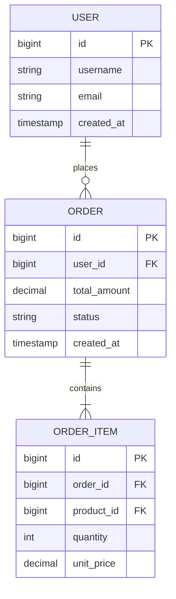
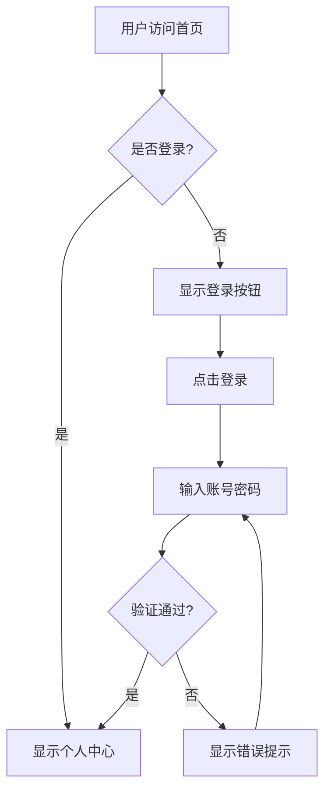
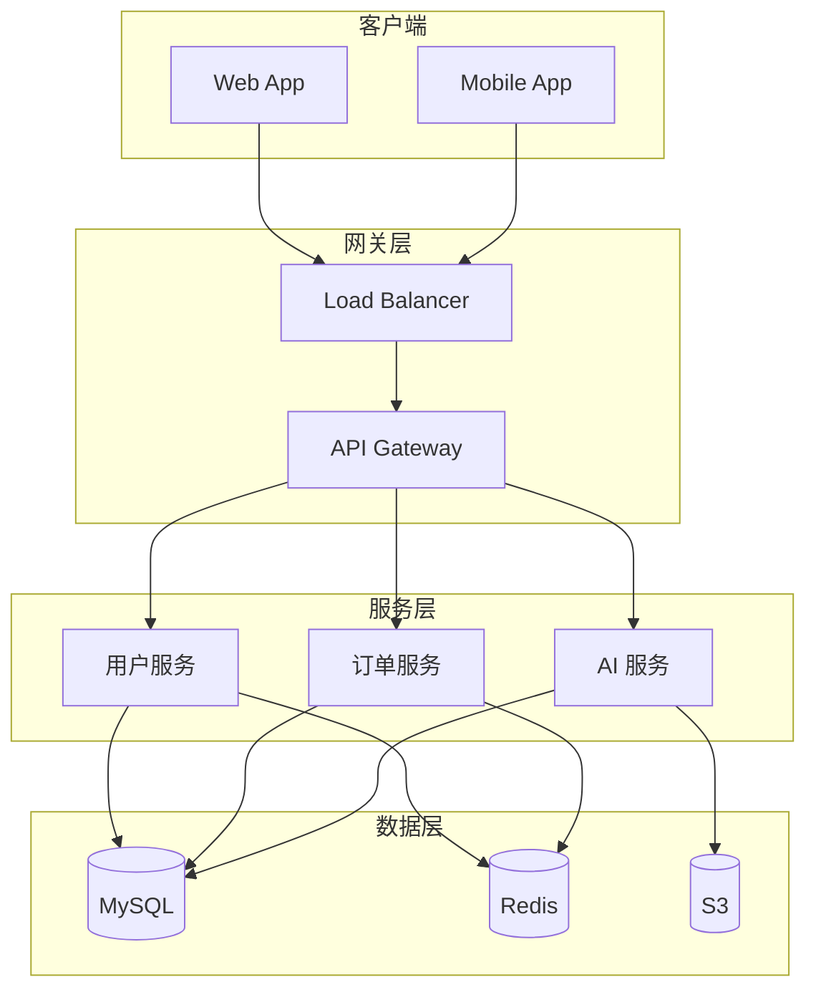
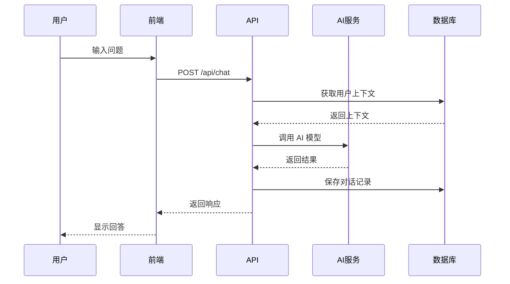
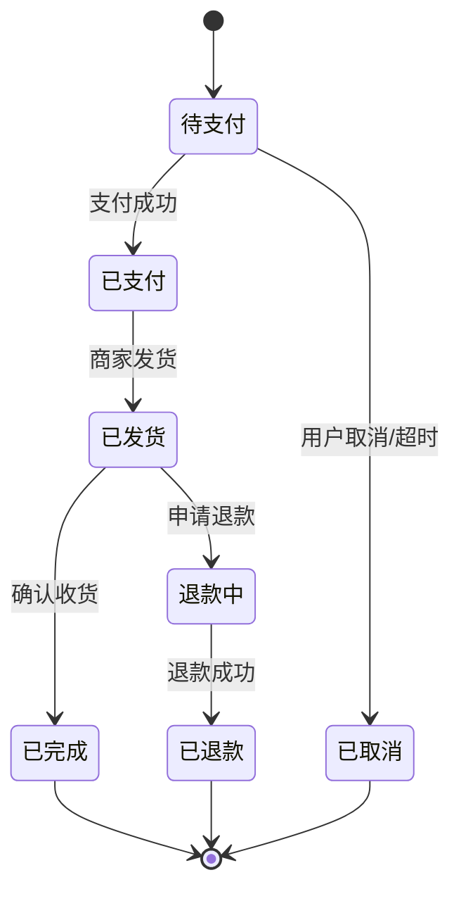

# 需求技术文档撰写 Skill

> 好的文档是成功项目的一半。本 Skill 帮助你撰写完整、规范、逻辑严谨的需求技术文档。

## 速查表

| 我想... | 跳转到 |
|---------|--------|
| **边讨论边写文档** | [渐进式撰写模式](#-渐进式撰写模式) |
| 写 PRD | [PRD 模板](#-产品需求文档-prd-模板) |
| 写技术方案 | [技术方案模板](#-技术方案文档模板) |
| 设计 API | [API 设计模板](#-api-设计文档模板) |
| 设计数据库 | [数据库设计模板](#-数据库设计文档模板) |
| 设计 AI 功能 | [AI 功能设计模板](#-ai-功能设计文档模板-) |
| 做竞品分析 | [竞品分析模板](#-竞品分析文档模板) |
| 画流程图 | [Mermaid 示例](#-mermaid-流程图示例) |
| 拆分任务 | [任务清单输出](#-任务清单输出自动生成) |

**两种模式**：渐进式（边讨论边写）/ 一次性（完整撰写）

---

## 关联 Skill

| Skill | 关系 | 说明 |
|-------|------|------|
| **requirement-discovery** | 上一步 | 需求调研完成后，开始撰写文档 |
| **doc-review** | 下一步 | 文档撰写完成后，使用 doc-review 进行评审 |
| **development** | 后续 | 文档评审通过后，进入开发阶段 |
| **code-review** | 后续 | 开发完成后，进行代码评审 |

**工作流**：`requirement-discovery` → `doc-writing` → `doc-review` → `development` → `code-review`

---

## 使用场景

当用户提出以下需求时，激活此 Skill：
- "帮我写一个需求文档"
- "设计一个功能的技术方案"
- "帮我整理 PRD"
- "设计 API 接口"
- "写一个 AI 功能的设计文档"
- **"帮我边讨论边写需求文档"** ← 渐进式模式
- **"我们先聊聊这个功能"** ← 渐进式模式
- 任何涉及需求整理、技术方案设计的请求

---

## 渐进式撰写模式

> 适用于需求还不清晰、需要边讨论边完善的场景

### 触发方式

```
"帮我边讨论边写需求文档"
"需求还没想清楚，我们先聊聊"
"我们讨论一下这个功能"
```

### 工作流程

```
1️⃣ 初始化 → 创建骨架文档（v0.1）
        ↓
2️⃣ 讨论 → 用户提出想法
        ↓
3️⃣ 更新 → AI 自动增量更新文档
        ↓
4️⃣ 循环 → 继续讨论，继续更新
        ↓
5️⃣ 完成 → 需求明确，文档就绪
```

### 增量更新规范

| 操作 | 标记 | 说明 |
|------|------|------|
| 新增内容 | `[NEW v0.2]` | 新讨论确认的内容 |
| 修改内容 | `[UPDATED v0.3]` | 变更已有内容 |
| 删除内容 | ~~删除线~~ | 不再需要的内容 |
| Bug 修复 | `[BUGFIX v0.4]` | 修复后更新文档 |

### 版本追踪模板

每次讨论更新后，在文档头部自动维护：

```markdown
## 版本历史
| 版本 | 日期 | 变更内容 | 触发原因 |
|------|------|---------|---------|
| v0.4 | MM-DD | 更新登录流程 | Bug修复 |
| v0.3 | MM-DD | 添加验证码需求 | 讨论补充 |
| v0.2 | MM-DD | 添加微信登录 | 用户需求 |
| v0.1 | MM-DD | 初始骨架 | 开始讨论 |
```

### 骨架文档模板

渐进式模式下，初始创建的文档只包含基本结构：

```markdown
# [功能名称] 需求文档（讨论中）

## 版本历史
| 版本 | 日期 | 变更内容 |
|------|------|---------|
| v0.1 | YYYY-MM-DD | 初始版本 |

## 功能目标
[待讨论]

## 目标用户
[待讨论]

## 功能清单
- [ ] [待讨论]

## 待确认事项
- [ ] [需要确认的问题1]
- [ ] [需要确认的问题2]

---
*此文档处于讨论阶段，持续更新中*
```

### 讨论过程中的操作

| 用户说 | AI 做 |
|--------|------|
| "添加微信登录功能" | 更新功能清单，标记 `[NEW]` |
| "改成手机号登录" | 修改相关内容，标记 `[UPDATED]` |
| "这个功能不要了" | 用删除线标记 |
| "这个 bug 修了" | 更新相关描述，标记 `[BUGFIX]` |
| "ok" / "行" / "就这样" | 确认当前讨论点 |
| "先这样" / "可以了" | 结束当前阶段，进入下一话题 |
| "定了" / "确认" / "需求确认了" | 正式确认，完成文档 |

### 快速确认机制

> 用自然语言确认，不需要说完整的"需求确认了"

#### 确认表达识别

| 用户说 | AI 理解 | 范围 |
|--------|--------|------|
| "ok" / "行" / "好" | 确认当前点 | 刚讨论的内容 |
| "就这样" / "先这样" | 阶段确认 | 当前话题锁定 |
| "可以了" / "差不多了" | 询问结束 | AI会问"还有要补充的吗?" |
| "定了" / "确认" | 正式确认 | 结束讨论，完成文档 |
| "全部确认" | 批量确认 | 所有待确认项 |

#### AI 主动询问

讨论到一定程度时，AI 会主动询问:

```
"目标用户我们讨论清楚了，要锁定吗?"
"核心功能已经列出6条，还有要补充的吗?"
"MVP范围确定了吗? 回复'ok'锁定，或继续讨论"
```

#### 批量确认

讨论结束时，AI 列出待确认清单:

```markdown
## 待确认清单

1. [OK] 目标用户: 年轻白领
2. [OK] 核心功能: 登录、发帖、评论
3. [ ] MVP范围: 待确认
4. [ ] 性能要求: 待确认

回复"全部确认"或指定修改项（如"3需要改"）
```

### 完成时的操作

当需求讨论完毕时:
1. 清理临时标记（`[NEW]`、`[UPDATED]`）
2. 更新状态为"已确认"
3. 更新版本号为 v1.0
4. 进入正常的 doc-review 流程

### 上下文管理（重要）

**AI 如何知道更新哪个文档？**

| 场景 | 操作 |
|------|------|
| **开始讨论** | 告诉 AI 文档路径或让 AI 创建 |
| **同一对话** | AI 自动记住，无需重复 |
| **新对话** | 需要告诉 AI 继续哪个文档 |
| **切换文档** | 明确说"现在讨论 XX 功能" |

**推荐的启动方式**：

```
# 方式1：让 AI 创建
"帮我边讨论边写用户登录的需求"
→ AI 创建 docs/用户登录-需求.md

# 方式2：指定路径
"帮我边讨论边写需求，文档放在 docs/功能需求/登录.md"

# 方式3：继续已有文档
"继续讨论 docs/登录.md，我有新想法"
```

**恢复上下文（新对话或中断后）**：

```
"继续讨论用户登录需求，文档在 docs/用户登录-需求.md"
"帮我更新 docs/登录.md，登录方式改成手机验证码"
```

**AI 会自动识别更新的场景**：

| 你说的话 | AI 判断 | 行动 |
|---------|--------|------|
| "添加微信登录" | [OK] 明确需求 | 自动更新文档 |
| "登录流程改一下" | [OK] 明确变更 | 自动更新文档 |
| "这个 bug 修了" | [OK] 状态变更 | 自动更新文档 |
| "微信登录好不好" | [?] 不确定 | AI 会问"需要添加吗？" |
| "我在想..." | [?] 还在思考 | AI 等待确认 |

---

## 文档撰写流程

### 第一步：需求收集（5W2H 分析法）

在撰写任何文档前，必须先确认以下问题：

| 维度 | 问题 | 必须明确 |
|------|------|---------|
| **What** | 要做什么？核心功能是什么？ | ✅ |
| **Why** | 为什么要做？解决什么问题？带来什么价值？ | ✅ |
| **Who** | 谁来用？目标用户是谁？ | ✅ |
| **When** | 什么时候需要？有没有时间节点？ | ⚠️ |
| **Where** | 在哪里使用？什么平台/入口？ | ✅ |
| **How** | 怎么实现？大致技术方案？ | ⚠️ |
| **How Much** | 资源投入？工作量估算？ | ⚠️ |

**如果用户没有提供足够信息，必须主动询问缺失的关键信息（标记为 ✅ 的项目）。**

---

### 第二步：选择文档类型

根据需求类型，选择合适的文档模板：

| 文档类型 | 适用场景 | 核心内容 |
|---------|---------|---------|
| **产品需求文档 (PRD)** | 新功能、新产品 | 用户故事、功能清单、交互流程 |
| **技术方案文档** | 复杂功能、架构设计 | 架构图、数据流、技术选型 |
| **API 设计文档** | 接口开发 | Endpoints、请求/响应、错误码 |
| **数据库设计文档** | 数据模型设计 | 表结构、字段说明、索引设计 |
| **AI 功能设计文档** | AI 相关功能 | Prompt 设计、模型选型、成本估算 |
| **竞品分析文档** | 产品调研 | 竞品对比、差异化策略 |

---

### 第三步：使用 MoSCoW 方法定义优先级

对于创业团队，使用 MoSCoW 方法快速确定 MVP 范围：

| 优先级 | 定义 | 说明 |
|--------|------|------|
| **Must Have** | 必须有 | 没有这个功能产品无法使用 |
| **Should Have** | 应该有 | 重要但可以稍后实现 |
| **Could Have** | 可以有 | 锦上添花的功能 |
| **Won't Have** | 不做 | 明确不在本期范围 |

---

### 第四步：撰写文档

#### 产品需求文档 (PRD) 模板

```markdown
# [功能名称] 产品需求文档

## 1. 文档信息
| 项目 | 内容 |
|------|------|
| 文档版本 | v1.0 |
| 创建日期 | YYYY-MM-DD |
| 最后更新 | YYYY-MM-DD |
| 状态 | 草稿/评审中/已确认 |

## 2. 背景与目标

### 2.1 背景
[描述当前存在的问题或机会]

### 2.2 目标
[明确要达成的目标，最好可量化]

### 2.3 成功指标
- 指标1：[具体指标和预期值]
- 指标2：[具体指标和预期值]

## 3. 用户故事

### 3.1 目标用户
[描述目标用户画像]

### 3.2 用户故事列表
| ID | 用户故事 | 优先级 |
|----|---------|-------|
| US-001 | 作为[角色]，我希望[功能]，以便[价值] | Must/Should/Could |
| US-002 | ... | ... |

## 4. 功能需求

### 4.1 功能清单（MoSCoW）
| ID | 功能名称 | 描述 | 优先级 |
|----|---------|------|-------|
| F-001 | ... | ... | Must Have |
| F-002 | ... | ... | Should Have |

### 4.2 功能详述
#### F-001: [功能名称]
- **描述**：[详细描述]
- **输入**：[用户输入什么]
- **处理**：[系统如何处理]
- **输出**：[返回给用户什么]
- **边界条件**：[特殊情况如何处理]

## 5. 交互设计

### 5.1 页面流程图
[使用 Mermaid 展示页面跳转逻辑，参见 Mermaid 示例章节]

### 5.2 关键页面说明
[每个关键页面的元素和交互说明]

## 6. 非功能性需求

### 6.1 性能需求
- 响应时间：[如 < 200ms]
- 并发支持：[如 1000 QPS]

### 6.2 安全需求
- [列出安全相关要求]

### 6.3 兼容性需求
- [支持的平台/设备/浏览器]

## 7. 数据需求
- 需要收集/存储的数据
- 数据保留策略
- 隐私合规要求

## 8. 依赖与约束
- 外部依赖：[第三方服务、API 等]
- 技术约束：[必须使用的技术栈等]
- 业务约束：[法规、政策等限制]

## 9. 里程碑与排期
| 里程碑 | 预计日期 | 交付物 |
|--------|---------|-------|
| 设计完成 | ... | ... |
| 开发完成 | ... | ... |
| 测试完成 | ... | ... |
| 上线 | ... | ... |

## 10. 风险与应对
| 风险 | 可能性 | 影响 | 应对措施 |
|------|-------|------|---------|
| ... | 高/中/低 | 高/中/低 | ... |

## 11. 附录
- 相关文档链接
- 原型图链接
- 参考资料
```

---

#### 技术方案文档模板

```markdown
# [功能名称] 技术方案

## 1. 文档信息
| 项目 | 内容 |
|------|------|
| 关联 PRD | [PRD 链接或编号] |
| 版本 | v1.0 |
| 状态 | 草稿/评审中/已确认 |

## 2. 需求概述
[简要描述要实现的功能，引用 PRD 中的关键需求]

## 3. 技术选型

### 3.1 方案对比
| 方案 | 优点 | 缺点 | 结论 |
|------|-----|------|-----|
| 方案 A | ... | ... | ✅ 推荐 |
| 方案 B | ... | ... | ❌ 不推荐 |

### 3.2 最终选型
[说明选择的技术方案及理由]

## 4. 架构设计

### 4.1 系统架构图
[使用 Mermaid 展示架构，参见 Mermaid 示例章节]

### 4.2 模块说明
| 模块 | 职责 | 技术栈 |
|------|-----|-------|
| ... | ... | ... |

### 4.3 数据流图
[展示数据在系统中的流转]

## 5. 数据库设计

### 5.1 表结构
#### 表名：[table_name]
| 字段名 | 类型 | 是否必填 | 默认值 | 说明 |
|-------|------|---------|-------|-----|
| id | BIGINT | ✅ | AUTO | 主键 |
| ... | ... | ... | ... | ... |

### 5.2 索引设计
| 索引名 | 字段 | 类型 | 说明 |
|--------|-----|------|-----|
| ... | ... | 普通/唯一 | ... |

## 6. 接口设计

### 6.1 接口清单
| 接口 | 方法 | 路径 | 说明 |
|------|-----|------|-----|
| ... | GET/POST | /api/... | ... |

### 6.2 接口详情
[每个接口的请求/响应格式，详见 API 设计文档模板]

## 7. 核心逻辑

### 7.1 流程图
[使用 Mermaid 展示核心业务流程]

### 7.2 算法说明
[如有复杂算法，说明实现逻辑]

## 8. 安全设计
- 认证方式：[如 JWT, Session]
- 权限控制：[如 RBAC]
- 数据加密：[如敏感字段加密]
- 输入校验：[防 SQL 注入、XSS 等]

## 9. 性能设计
- 缓存策略：[如 Redis 缓存热点数据]
- 数据库优化：[如读写分离、分库分表]
- 异步处理：[如消息队列处理耗时操作]

## 10. 监控与告警
- 关键指标：[如 QPS、响应时间、错误率]
- 告警阈值：[如错误率 > 1% 告警]
- 日志记录：[需要记录的关键日志]

## 11. 测试计划
- 单元测试：[覆盖率要求]
- 集成测试：[关键场景]
- 压力测试：[性能指标]

## 12. 上线计划
- 灰度策略：[如 5% -> 20% -> 100%]
- 回滚方案：[如何快速回滚]
- 兼容处理：[新老版本兼容]

## 13. 任务拆分与排期
| 任务 | 负责人 | 预计工时 | 状态 |
|------|--------|---------|-----|
| ... | ... | ... | 待开始/进行中/完成 |

## 14. 附录
- 相关文档
- 参考资料
```

---

#### API 设计文档模板

```markdown
# [模块名称] API 设计文档

## 1. 概述
- API 基础路径：`/api/v1/[module]`
- 认证方式：Bearer Token
- 响应格式：JSON

## 2. 通用规范

### 2.1 请求头
| Header | 必填 | 说明 |
|--------|-----|------|
| Authorization | ✅ | Bearer {token} |
| Content-Type | ✅ | application/json |

### 2.2 通用响应格式
```json
{
  "code": 0,
  "message": "success",
  "data": { ... },
  "timestamp": 1234567890
}
```

### 2.3 错误码规范
| 错误码 | 说明 |
|--------|-----|
| 0 | 成功 |
| 10001 | 参数错误 |
| 10002 | 认证失败 |
| 10003 | 权限不足 |
| 20001 | 资源不存在 |
| 50001 | 服务器内部错误 |

## 3. 接口详情

### 3.1 [接口名称]

**基本信息**
| 项目 | 内容 |
|------|------|
| 路径 | `POST /api/v1/xxx` |
| 描述 | [接口描述] |
| 权限 | [需要的权限] |

**请求参数**
| 参数名 | 类型 | 必填 | 说明 | 示例 |
|--------|-----|------|-----|------|
| field1 | string | ✅ | 字段说明 | "example" |
| field2 | integer | ❌ | 字段说明 | 123 |

**请求示例**
```json
{
  "field1": "example",
  "field2": 123
}
```

**响应参数**
| 参数名 | 类型 | 说明 |
|--------|-----|------|
| id | integer | 记录 ID |
| ... | ... | ... |

**响应示例**
```json
{
  "code": 0,
  "message": "success",
  "data": {
    "id": 1,
    ...
  }
}
```

**错误处理**
| 场景 | 错误码 | 错误信息 |
|------|--------|---------|
| 参数为空 | 10001 | "field1 is required" |
| ... | ... | ... |
```

---

#### 数据库设计文档模板

```markdown
# [模块名称] 数据库设计文档

## 1. 文档信息
| 项目 | 内容 |
|------|------|
| 关联技术方案 | [技术方案链接] |
| 数据库类型 | MySQL / PostgreSQL / MongoDB |
| 版本 | v1.0 |

## 2. 设计原则
- 命名规范：snake_case
- 主键策略：自增 / UUID / 雪花算法
- 时间字段：使用 TIMESTAMP，存储 UTC 时间
- 软删除：使用 deleted_at 字段

## 3. ER 图



## 4. 表设计详情

### 4.1 表名：users（用户表）

**表说明**：存储用户基本信息

| 字段名 | 类型 | 是否必填 | 默认值 | 索引 | 说明 |
|-------|------|---------|-------|------|-----|
| id | BIGINT | ✅ | AUTO_INCREMENT | PK | 主键 |
| username | VARCHAR(50) | ✅ | - | UNIQUE | 用户名 |
| email | VARCHAR(100) | ✅ | - | UNIQUE | 邮箱 |
| password_hash | VARCHAR(255) | ✅ | - | - | 密码哈希 |
| status | TINYINT | ✅ | 1 | INDEX | 状态：1-正常 2-禁用 |
| created_at | TIMESTAMP | ✅ | CURRENT_TIMESTAMP | - | 创建时间 |
| updated_at | TIMESTAMP | ✅ | CURRENT_TIMESTAMP | - | 更新时间 |
| deleted_at | TIMESTAMP | ❌ | NULL | - | 删除时间（软删除） |

**索引设计**
| 索引名 | 字段 | 类型 | 说明 |
|--------|-----|------|-----|
| uk_username | username | UNIQUE | 用户名唯一 |
| uk_email | email | UNIQUE | 邮箱唯一 |
| idx_status | status | NORMAL | 状态查询 |

**建表语句**
```sql
CREATE TABLE users (
    id BIGINT PRIMARY KEY AUTO_INCREMENT,
    username VARCHAR(50) NOT NULL,
    email VARCHAR(100) NOT NULL,
    password_hash VARCHAR(255) NOT NULL,
    status TINYINT NOT NULL DEFAULT 1,
    created_at TIMESTAMP NOT NULL DEFAULT CURRENT_TIMESTAMP,
    updated_at TIMESTAMP NOT NULL DEFAULT CURRENT_TIMESTAMP ON UPDATE CURRENT_TIMESTAMP,
    deleted_at TIMESTAMP NULL,
    UNIQUE KEY uk_username (username),
    UNIQUE KEY uk_email (email),
    KEY idx_status (status)
) ENGINE=InnoDB DEFAULT CHARSET=utf8mb4;
```

## 5. 数据迁移

### 5.1 迁移脚本
- `V1__create_users_table.sql`：创建用户表
- `V2__add_avatar_column.sql`：添加头像字段

### 5.2 回滚策略
每个迁移脚本必须有对应的回滚脚本。

## 6. 数据字典

### 6.1 状态枚举
| 表名 | 字段名 | 值 | 说明 |
|------|--------|-----|-----|
| users | status | 1 | 正常 |
| users | status | 2 | 禁用 |
| orders | status | pending | 待支付 |
| orders | status | paid | 已支付 |
| orders | status | shipped | 已发货 |
| orders | status | completed | 已完成 |
| orders | status | cancelled | 已取消 |
```

---

#### 竞品分析文档模板

```markdown
# [产品/功能] 竞品分析文档

## 1. 分析目的
[说明为什么要做这个竞品分析，要解决什么问题]

## 2. 分析范围

### 2.1 竞品选择
| 竞品 | 类型 | 选择理由 |
|------|------|---------|
| 竞品A | 直接竞品 | 功能相似，目标用户相同 |
| 竞品B | 间接竞品 | 解决同类问题，但方式不同 |
| 竞品C | 参考产品 | 交互/设计值得借鉴 |

### 2.2 分析维度
- 核心功能
- 用户体验
- 商业模式
- 技术实现

## 3. 竞品详情

### 3.1 竞品A: [名称]

**基本信息**
| 项目 | 内容 |
|------|------|
| 官网 | [URL] |
| 上线时间 | YYYY-MM |
| 目标用户 | [用户画像] |
| 定价策略 | 免费/付费/... |

**核心功能**
| 功能 | 描述 | 优点 | 缺点 |
|------|------|------|------|
| 功能1 | ... | ... | ... |
| 功能2 | ... | ... | ... |

**用户评价**
- 正面评价：...
- 负面评价：...

**技术亮点**
- [技术特点1]
- [技术特点2]

## 4. 功能对比矩阵

| 功能 | 我们 | 竞品A | 竞品B | 竞品C |
|------|------|-------|-------|-------|
| 功能1 | ✅ | ✅ | ❌ | ✅ |
| 功能2 | ⚠️ 计划中 | ✅ | ✅ | ❌ |
| 功能3 | ❌ | ❌ | ✅ | ✅ |

## 5. SWOT 分析

### 5.1 我们的 SWOT
| Strengths（优势） | Weaknesses（劣势） |
|------------------|-------------------|
| - 优势1 | - 劣势1 |
| - 优势2 | - 劣势2 |

| Opportunities（机会） | Threats（威胁） |
|----------------------|-----------------|
| - 机会1 | - 威胁1 |
| - 机会2 | - 威胁2 |

## 6. 差异化策略

### 6.1 我们的定位
[一句话描述我们的差异化定位]

### 6.2 差异化方向
| 方向 | 策略 | 优先级 |
|------|------|-------|
| 功能差异 | ... | 高 |
| 体验差异 | ... | 中 |
| 定价差异 | ... | 低 |

## 7. 结论与建议

### 7.1 关键发现
1. [发现1]
2. [发现2]
3. [发现3]

### 7.2 行动建议
1. **短期**：[立即要做的事]
2. **中期**：[1-3个月内要做的事]
3. **长期**：[3-6个月内要做的事]

## 8. 附录
- 截图记录
- 数据来源
- 参考链接
```

---

#### AI 功能设计文档模板

```markdown
# [AI功能名称] 设计文档

## 1. 文档信息
| 项目 | 内容 |
|------|------|
| 关联 PRD | [PRD 链接] |
| 版本 | v1.0 |
| 状态 | 草稿/评审中/已确认 |

## 2. 功能概述

### 2.1 功能描述
[描述 AI 功能要实现什么]

### 2.2 用户价值
[这个 AI 功能为用户带来什么价值]

### 2.3 成功指标
| 指标 | 目标值 | 测量方式 |
|------|--------|---------|
| 准确率 | > 90% | 人工抽检 |
| 响应时间 | < 2s | 监控统计 |
| 用户满意度 | > 4.0 | 用户评分 |

## 3. AI 模型选型

### 3.1 候选模型对比
| 模型 | 提供方 | 优点 | 缺点 | 成本 | 结论 |
|------|--------|------|------|------|------|
| GPT-4o | OpenAI | 效果最好 | 成本高 | $5/1M tokens | ⚠️ 备选 |
| GPT-4o-mini | OpenAI | 性价比高 | 效果一般 | $0.15/1M tokens | ✅ 推荐 |
| Claude 3.5 Sonnet | Anthropic | 效果好 | 略慢 | $3/1M tokens | ⚠️ 备选 |
| 本地模型 | 自建 | 成本低 | 效果差 | 固定成本 | ❌ 不推荐 |

### 3.2 选型决策
**选择**：[最终选择的模型]
**理由**：[选择的理由]

## 4. Prompt 设计

### 4.1 System Prompt
```
你是一个[角色描述]。

## 你的任务
[明确任务描述]

## 输出要求
- [要求1]
- [要求2]

## 约束条件
- [约束1]
- [约束2]

## 输出格式
[指定输出格式，如 JSON]
```

### 4.2 User Prompt 模板
```
## 用户输入
{user_input}

## 上下文信息
{context}

请根据以上信息，完成任务。
```

### 4.3 Prompt 版本管理
| 版本 | 日期 | 变更说明 | 效果 |
|------|------|---------|------|
| v1.0 | YYYY-MM-DD | 初始版本 | 准确率 85% |
| v1.1 | YYYY-MM-DD | 增加示例 | 准确率 90% |

## 5. 输入输出设计

### 5.1 输入规范
| 字段 | 类型 | 必填 | 说明 | 示例 |
|------|------|------|------|------|
| user_input | string | ✅ | 用户输入 | "帮我写一封邮件" |
| context | object | ❌ | 上下文信息 | {...} |
| max_tokens | integer | ❌ | 最大输出长度 | 1000 |

### 5.2 输出规范
```json
{
  "success": true,
  "data": {
    "content": "AI 生成的内容",
    "confidence": 0.95,
    "tokens_used": {
      "input": 100,
      "output": 200
    }
  },
  "error": null
}
```

### 5.3 错误处理
| 错误场景 | 错误码 | 用户提示 | 处理方式 |
|---------|--------|---------|---------|
| 模型超时 | AI_TIMEOUT | "AI 正在思考，请稍后重试" | 自动重试1次 |
| 内容违规 | AI_CONTENT_BLOCKED | "内容不合规，请修改后重试" | 记录日志 |
| Token 超限 | AI_TOKEN_LIMIT | "输入过长，请精简后重试" | 提示用户 |
| 模型不可用 | AI_SERVICE_UNAVAILABLE | "服务暂时不可用" | 切换备用模型 |

## 6. 成本控制

### 6.1 Token 消耗估算
| 场景 | 输入 Tokens | 输出 Tokens | 单次成本 |
|------|------------|------------|---------|
| 场景A | ~500 | ~1000 | $0.0015 |
| 场景B | ~1000 | ~2000 | $0.003 |

### 6.2 成本控制策略
| 策略 | 说明 | 节省比例 |
|------|------|---------|
| 缓存相似请求 | 相同输入返回缓存结果 | ~30% |
| 限制输出长度 | 设置 max_tokens | ~20% |
| 分级模型 | 简单任务用便宜模型 | ~50% |
| 用户配额 | 每日调用次数限制 | 可控 |

### 6.3 预算规划
| 月份 | 预计调用量 | 预计成本 |
|------|-----------|---------|
| 第1月 | 10万次 | $150 |
| 第3月 | 50万次 | $750 |
| 第6月 | 100万次 | $1500 |

## 7. 安全设计

### 7.1 Prompt 注入防护
- 输入校验：过滤特殊字符和指令
- 角色隔离：System Prompt 中明确角色边界
- 输出过滤：检查输出是否包含敏感信息

### 7.2 内容安全
- 敏感词过滤
- 调用内容审核 API
- 人工审核机制

### 7.3 数据隐私
- 不记录用户敏感数据
- 符合 GDPR 等隐私法规
- 定期清理日志

## 8. 监控与优化

### 8.1 关键指标
| 指标 | 说明 | 告警阈值 |
|------|------|---------|
| 调用成功率 | 成功调用 / 总调用 | < 99% |
| 平均响应时间 | 从请求到响应 | > 3s |
| Token 消耗 | 每日/每周/每月 | 超预算 20% |
| 用户满意度 | 好评 / 总评价 | < 80% |

### 8.2 A/B 测试计划
| 测试项 | A 组 | B 组 | 目标指标 |
|--------|------|------|---------|
| Prompt 版本 | v1.0 | v1.1 | 准确率 |
| 模型选择 | GPT-4o-mini | Claude | 用户满意度 |

## 9. 上线计划

### 9.1 灰度发布
- 5% 用户：内测用户
- 20% 用户：观察一周
- 100% 用户：全量发布

### 9.2 回滚方案
- 降级方案：切换到规则引擎
- 回滚条件：成功率 < 95% 或 响应时间 > 5s
```

---

## Mermaid 流程图示例

### 用户流程图


### 系统架构图


### 时序图


### 状态图


---

## 撰写原则

### 1. 完整性原则
- 每个功能都必须有明确的输入、处理、输出
- 必须考虑边界条件和异常情况
- 必须定义验收标准

### 2. 一致性原则
- 术语使用统一，首次出现时定义
- 格式风格统一
- 与现有系统设计保持一致

### 3. 可执行原则
- 需求描述必须具体，不能模糊
- 避免使用"等"、"可能"、"大概"等词汇
- 数值必须明确，如"响应时间 < 200ms"

### 4. 可追溯原则
- 每个需求要有唯一编号
- 技术方案要关联 PRD
- 代码实现要能追溯到需求

### 5. 快速迭代原则（创业团队特有）
- 优先完成 MVP，快速验证
- 技术债可以先记录，后续偿还
- 文档详细程度与功能重要性成正比

---

## 完成检查清单

文档完成后，必须检查以下项目：

- [ ] 5W2H 信息是否完整？
- [ ] 用户故事是否明确？
- [ ] 功能边界是否清晰？
- [ ] 非功能性需求是否定义？
- [ ] 数据需求是否明确？
- [ ] 验收标准是否可量化？
- [ ] 依赖和约束是否列出？
- [ ] 风险是否识别并有应对措施？
- [ ] MoSCoW 优先级是否明确？
- [ ] 流程图是否清晰？

---

## 任务清单输出（自动生成）

**每次完成需求文档后，必须同时输出任务清单**，用于后续进度追踪。

### 任务清单模板

```markdown
# [功能名称] 任务清单

## 📊 概览
| 项目 | 内容 |
|------|------|
| 关联文档 | [PRD/技术方案链接] |
| 创建日期 | YYYY-MM-DD |
| 预计工时 | X 人天 |
| 目标完成 | YYYY-MM-DD |

## 📋 任务列表

### Must Have（必须完成）
| # | 任务 | 负责人 | 估时 | 状态 | 备注 |
|---|------|-------|------|------|------|
| 1 | [具体任务描述] | - | 2h | ⬜ 待开始 | |
| 2 | [具体任务描述] | - | 4h | ⬜ 待开始 | |

### Should Have（应该完成）
| # | 任务 | 负责人 | 估时 | 状态 | 备注 |
|---|------|-------|------|------|------|
| 3 | [具体任务描述] | - | 2h | ⬜ 待开始 | |

### Could Have（可选）
| # | 任务 | 负责人 | 估时 | 状态 | 备注 |
|---|------|-------|------|------|------|
| 4 | [具体任务描述] | - | 2h | ⬜ 待开始 | 时间允许再做 |

## 📈 进度统计
- 总任务：N 个
- 已完成：0 (0%)
- 进行中：0
- 待开始：N

## ⚠️ 风险 & 阻塞
| 风险/阻塞 | 影响 | 应对 |
|-----------|------|------|
| - | - | - |

## 📝 备注
- 任务状态：⬜待开始 / 🔄进行中 / ✅已完成 / ⏸️暂停 / ❌取消
- 进度更新请使用 development skill
```

### 任务拆分原则

1. **粒度适中**：每个任务 1-4 小时
2. **可独立**：任务可以独立完成和测试
3. **可验证**：有明确的完成标准
4. **按优先级**：Must → Should → Could

### 工时估算参考

| 任务类型 | 参考工时 |
|---------|---------|
| 简单 API | 2-4h |
| 复杂 API | 4-8h |
| 简单页面 | 2-4h |
| 复杂页面 | 8-16h |
| 数据库设计 | 2-4h |
| AI Prompt 调优 | 4-8h |

---

## 文档国际化（可选）

如果需要将文档翻译成多语言版本（如开源项目），可使用 skill-i18n:

```bash
# 翻译当前文档为多语言
/skill-i18n

# 指定语言
/skill-i18n --lang zh-CN,ja,en
```

**翻译规则**:

| 保持不变 | 自然翻译 |
|---------|----------|
| 代码块 | 标题和正文 |
| 文件路径 | 表格说明 |
| 命令名 | 注释内容 |
| URL 和链接 | 用户界面文案 |
| 技术标识符 | - |

> 工具来源: [guo-yu/skills/skill-i18n](https://github.com/guo-yu/skills)

---

## 修改已有文档

如果是修改已有文档（而非创建新文档）：
- 使用**增量修改**，不要重写整个文件
- 更新版本号和日期
- 保留修改记录

---

## 下一步

文档撰写完成后，请使用 **doc-review** skill 进行评审：
> "帮我评审一下这个需求文档"
