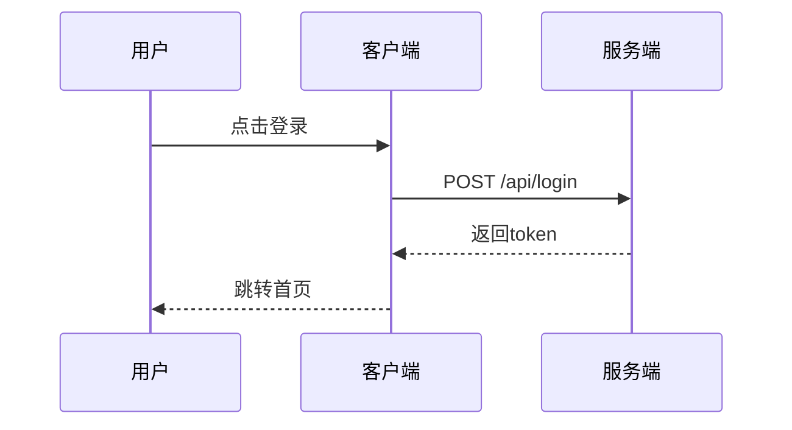
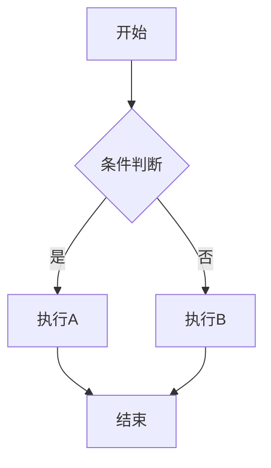
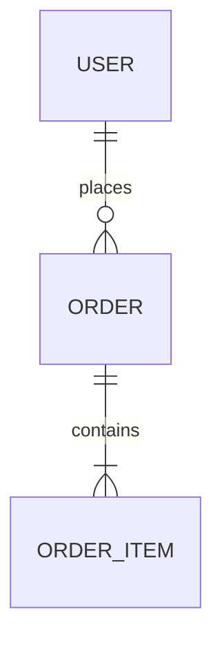

# 文档撰写模板库

> 本目录包含各类文档撰写的模板和参考

## 模板列表

| 模板 | 用途 | 位置 |
|------|------|------|
| PRD模板 | 产品需求文档 | 见 SKILL.md |
| 技术方案模板 | 技术设计文档 | 见 SKILL.md |
| API设计模板 | 接口设计文档 | 见 SKILL.md |
| 数据库设计模板 | 表结构设计 | 见 SKILL.md |
| AI功能设计模板 | AI功能专项 | 见 SKILL.md |
| 竞品分析模板 | 竞品对比分析 | 见 SKILL.md |

---

## Mermaid 图表参考

### 时序图

### 流程图

### ER图

---

## 参考资源

- [会话持久化规范](../development/references/session-management.md)
